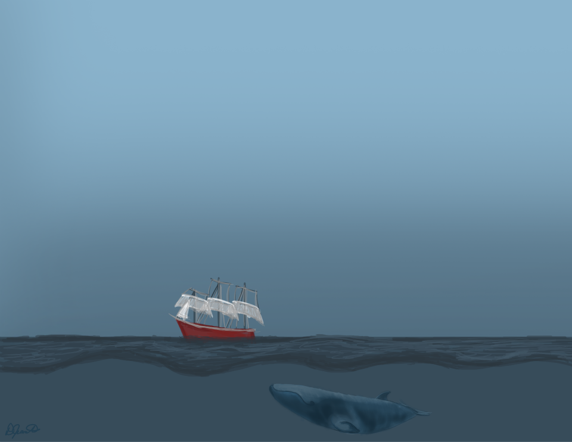

# **DreamaBrand Art Galary**

This is a template example for lab journaling. Students in Matt Crump's Human Cognition and Performance Lab will use this template to learn R, and other things. Students can replace this text with more fun things. People not in my lab can use this too.

## Welcome to DreamaBrand

1. DreamaBand was established on July 16, 2021 at a basement in Charlottetown, PEI, Canada. For more information, please refer [https://github.com/cai45808/DreamerBrand/settings/pages](https://cai45808.github.io/DreamerBrand/index.html)

2. Brower all the arts. See the [Paintings](https://cai45808.github.io/DreamerBrand/Journal.html) for an example of what we have.

3. See the [Biography](https://cai45808.github.io/DreamerBrand/Links.html) for lots of helpful links on learning R.

4. Change everything to make it your own.

### [GO fighting](https://cai45808.github.io/DreamerBrand/index.html)

</a>

